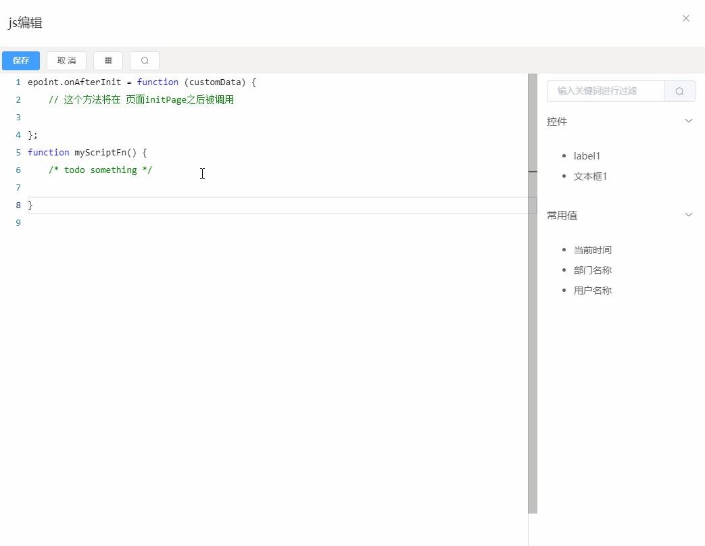

# 代码编辑说明

表单设计器中集成了 `monaco-editor` 编辑器，用于支持项目自行加入 css 和 JavaScript 代码。

## css 编辑

css 编辑无需赘述，常规编写即可，最终代码将以 style 标签的形式插入到页面head中。

## JavaScript 编辑

为方便在其中高效编码，JavaScript中集成了常用的 jQuery 、miniui 、 epoint 等api自动补全和提示。请参考下图：

JavaScript 的编辑有以下注意点：

1. 需要在initPage回调之前或之后特定时机执行的代码。  
    使用相关api回调函数即可，具体可参考: [https://fe.epoint.com.cn/f9fedoc/?file=007-常用API/002-epoint通用方法#事件说明](https://fe.epoint.com.cn/f9fedoc/?file=007-%E5%B8%B8%E7%94%A8API/002-epoint%E9%80%9A%E7%94%A8%E6%96%B9%E6%B3%95#%E4%BA%8B%E4%BB%B6%E8%AF%B4%E6%98%8E) , 最常见的需求为，一些代码需要在 `initPage` 之后执行，则可以定义 `epoint.onAfterInit` 函数，将代码写在其中即可。
2. 控件id和特殊值
    - 控件id为设计器生成，如需使用可直接在右侧点击对应的控件，代码编辑器中将自动插入获取控件的代码。
    - 特殊值将在页面代码生成活页面运行时进行注入，其本身仅是一个特殊占位符，将在必要时由服务端替换为真实值。其标识无需记忆，直接在右侧列表中点击对应的常用值即可直接插入。
