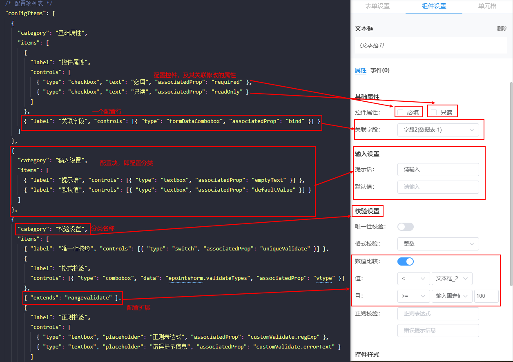
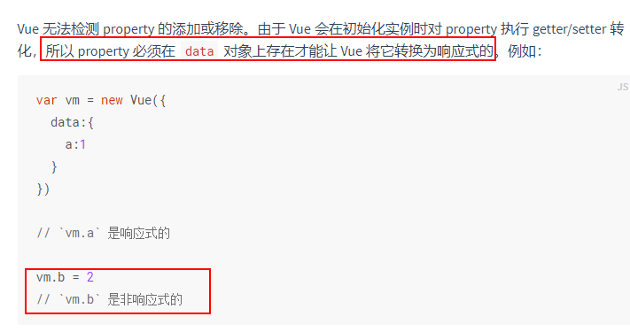
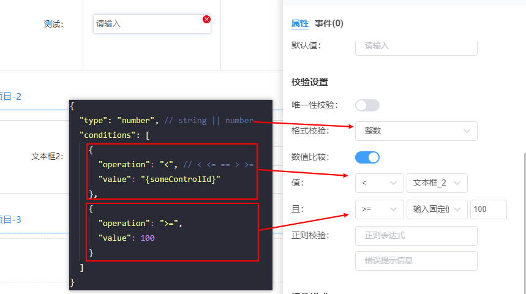

# 配置说明

表单设计器中右侧的配置面板由一个json文件构成，其主要包含如下信息：

1. 这个控件有哪些属性可配置，其默认值是什么。
2. 针对上面的可配置属性，分别用什么控件去配置。

以下将以一个配置实例，来讲解具体配置的详情

## 配置示例

以 textbox 控件为例，来介绍配置格式

```js
{
  "id": "", // 自动生成
  "type": "textbox",

  /* 控件需要配置属性 start */
  "required": false,
  "readOnly": false,
  "bind": "",
  "emptyText": "",
  // 默认值
  "defaultValue": "",
  "vtype": "",
  "rangeValidator": null,
  // {
  //   "type": "string", // string || number
  //   "conditions": [
  //     {
  //       "operation": "==",
  //       "value": "{someControlId}"
  //     },
  //     {
  //       "operation": ">=",
  //       "value": "123"
  //     }
  //   ]
  // }
  // 正则校验
  "customValidate": { "regExp": "", "errorText": "" },
  // 唯一性校验
  "uniqueValidate": false,
  "width": "",

  // 支持的事件列表
  "supportEvents": ["valuechanged"],
  // 事件配置对象
  "events": {},
  
  "tooltipConfig": {
    "type": "tooltip", // tooltip 、 right 之一
    "content": ""
  },

  /* 控件需要配置属性 end */

  /* 配置项列表 */
  "configItems": [
    {
      "category": "基础属性",
      "items": [
        {
          "label": "控件属性",
          "controls": [
            { "type": "checkbox", "text": "必填", "associatedProp": "required" },
            { "type": "checkbox", "text": "只读", "associatedProp": "readOnly" }
          ]
        },
        { "label": "关联字段", "controls": [{ "type": "formDataCombobox", "associatedProp": "bind" }] }
      ]
    },
    {
      "category": "输入设置",
      "items": [
        { "label": "提示语", "controls": [{ "type": "textbox", "associatedProp": "emptyText" }] },
        { "label": "默认值", "controls": [{ "type": "textbox", "associatedProp": "defaultValue" }] }
      ]
    },
    {
      "category": "校验设置",
      "items": [
        { "label": "唯一性校验", "controls": [{ "type": "switch", "associatedProp": "uniqueValidate" }] },
        {
          "label": "格式校验",
          "controls": [{ "type": "combobox", "data": "epointsform.validateTypes", "associatedProp": "vtype" }]
        },
        { "extends": "rangevalidate" },
        {
          "label": "正则校验",
          "controls": [
            { "type": "textbox", "placeholder": "正则表达式", "associatedProp": "customValidate.regExp" },
            { "type": "textbox", "placeholder": "错误提示信息", "associatedProp": "customValidate.errorText" }
          ]
        }
      ]
    },
    {
      "category": "控件样式",
      "items": [{ "label": "宽度", "controls": [{ "type": "widthConfig", "associatedProp": "width" }] }]
    },
    {
      "category": "备注提示",
      "items": [{ "extends": ["tooltipconfig"] }]
    }
  ]
  /* 配置项列表 end */
}
```



以下内容描述请结合上方代码和图示查看。

### id

控件 id 留空即可，将在创建控件时自动生成。

### type

即控件类型，用于将此配置文件和控件相关联，即当激活某个类型的控件时，右侧将根据此来寻找配置文件并渲染配置面板。

### 控件需要配置属性

此处需完整列出控件需要配置修改的属性，键名为最终提交时的控件属性名称，值为控件此属性的初始值。 控件无需配置的属性无需列出，但是**需要配置的属性必须全部列出**。

::: warning
为什么要列出全部的需要修改的配置属性？  

这是由于所使用的 vue 响应式原理决定的，其在依赖收集时，会遍历获取属性，添加依赖。如果不添加需要配置的属性可能导致依赖收集不到，修改无法实时在设计器中反应的问题。 [vue 深入响应式原理](https://cn.vuejs.org/v2/guide/reactivity.html#%E5%AF%B9%E4%BA%8E%E5%AF%B9%E8%B1%A1)


:::

### 配置项列表

配置项列表放置在 `configItems` 属性中， 其中每个成员为一个对象，其表示一个配置区块。

**配置区块**

即将控件的一部分属性进行分类，一个区块即代表一个分类。

其中有两个必要属性：

1. `category` 表示当前区块（分类）的名称。
2. `items` 表示当前分类下有哪些配置条目，值为一个数组，每个成员代表一行配置。

以如下代码为例：

```js
{
  "category": "基础属性",
  "items": [
    {
      "label": "控件属性",
      "controls": [
        { "type": "checkbox", "text": "必填", "associatedProp": "required" },
        { "type": "checkbox", "text": "只读", "associatedProp": "readOnly" }
      ]
    },
    { "label": "关联字段", "controls": [{ "type": "formDataCombobox", "associatedProp": "bind" }] }
  ]
}
```

即表示有一个分类名称为基础属性的分类，下面有两块配置，一个用于配置控件的属性必填和只读，另一个为关联字段的配置。

**配置条目**

常规配置条目直接使用 label + 控件 即可完成，一个配置条目有以下两个属性：

1. `label` 此配置项目的名称。
2. `controls` 此配置项目下使用哪些控件来进行配置。 注意值为一个数组，成员为配置控件。

此外还存在一种配置扩展，请参考下文。

**用于配置的控件**

配置控件用于在右侧面板中展示要操作的控件的某个属性值，并在用户进行操作修改时，将最新的修改配置到目标控件上去。

其有如下两个必要属性：

1. `type` 用于标识使用什么控件来配置。
2. `associatedProp` 关联的属性，即这个控件要展示和修改控件的哪个属性。

其他依据控件不同可能有其他属性。

以如下高亮的三行代码为例：

```js{7,8,11}
{
  "category": "基础属性",
  "items": [
    {
      "label": "控件属性",
      "controls": [
        { "type": "checkbox", "text": "必填", "associatedProp": "required" },
        { "type": "checkbox", "text": "只读", "associatedProp": "readOnly" }
      ]
    },
    { "label": "关联字段", "controls": [{ "type": "formDataCombobox", "associatedProp": "bind" }] }
  ]
}
```

第 7、8 行表示使用 `checkbox` 控件来配置目标控件的 `required` 和 `readOnly` 其显示的文字分别为 **必填** 和 **只读**。

第 11 行则表示使用 `formDataCombobox` 控件来胚子目标控件的 `bind` 属性。

**配置扩展**

针对一些复杂的配置属性，单纯的通过控件修改某个属性难以胜任，因此还存在一种配置扩展类型。

其直接放置在配置分类的配置项中，其无需包含 `label` 和 `controls`, 其直接通过 `extends` 作为属性名，值为一个字符串或字符串数组，为字符串时及为配置扩展名称，数组情况则为数组成员为扩展名称。

如：

```js{9}
{
  "category": "校验设置",
  "items": [
    { "label": "唯一性校验", "controls": [{ "type": "switch", "associatedProp": "uniqueValidate" }] },
    {
      "label": "格式校验",
      "controls": [{ "type": "combobox", "data": "epointsform.validateTypes", "associatedProp": "vtype" }]
    },
    { "extends": "rangevalidate" },
    {
      "label": "正则校验",
      "controls": [
        { "type": "textbox", "placeholder": "正则表达式", "associatedProp": "customValidate.regExp" },
        { "type": "textbox", "placeholder": "错误提示信息", "associatedProp": "customValidate.errorText" }
      ]
    }
  ]
}
```

其中第 9 行就是一个配置扩展的示例。

其存在的意义在于其配置逻辑复杂，需要控件多，且其中存在交互影响，仅通过单个或多个控件修改属性无法得出。

以 `rangevalidate` 来说，其实现了如下功能：

1. 首先仅当文本框的输入类型为 `数值` 或 `字符串` 时才会出现范围配置。
2. 范围配置要配置最小值、最大值，或者两者并存。最大最小还存在是否包含边界的区分。
3. 范围的最大最小时，可能是用户直接输入的一个固定值，也可能是一些特殊值，还可以是页面上其他某个控件的取值。



其配置结果为:

```js
{
  "type": "number", // string || number
  "conditions": [
    {
      "operation": "<", // < <= == > >=
      "value": "{someControlId}"
    },
    {
      "operation": ">=",
      "value": 100
    }
  ]
}
```

## 配置原理

针对配置控件，加载渲染面板时，会根据 `associatedProp` 读取响应初始值，赋值给配置控件。用户进行操作时，配置控件将会触发 `change` 事件，同时提交要修改的属性名和最新的属性值，由配置中心统一负责将最新值修改到目标控件上去。

针对配置扩展，实现机制和基本配置控件相似，唯一不同的是，配置扩展加载时可以获取全部的控件配置，而非只有 `associatedProp` 对应的属性值。

## 配置控件列表

- `checkbox` 勾选框，额外属性 `text` ， 用于配置显示的文字信息。
- `checkboxlist`：勾选框列表，
    - 额外属性 `data`, 用于配置勾选列表。
        - 值为数组时，每个成员为一个勾选框数据 格式如 : `[{id:'o1', text: '选项1'},   {id:'o2', text: '选项2'}]`
        - 值为字符串时，也是静态数据源，值将会从 `epointsform` 下获取，即一些常用预设列表。
    - 额外属性 `url` ，用户配置远程数据源，返回格式同上，仅在没有 `data` 属性时生效。
- `combobox`： 下拉选择框，格式同 checkboxlist 。
- `defaultdate`： 默认日期配置控件。
- `filetypepicker`： 文件类型选择配置控件，用于给上传控件等配置上传文件的类型。
- `fontcolor`： 文本颜色配置控件，用于颜色选择。
- `formdatacombobox`：字段配置下拉框，用于给控件配置 bind 属性。
- `numbertextbox`： 数值输入框，即只能输入数字。
- `radiobuttonlist`： 单选框列表，配置同 checkboxlist 。
- `switch`： 开关控件，即表示某属性是否开启，值为布尔值。
- `textbox`： 文本输入框，用于配置需要输入文本内容的地方。
- `widthconfig`： 宽度配置控件，默认集成两种单位支持， `px` 和百分比。

## 配置控件扩展

- `alignconfig`: 对其方式配置扩展，用于修改 textAlign 属性。
- `buttoneditfield`: 用于配置一些控件的值字段和显示字段。
- `dataaction`: 用于给控件配置数据源，即 action 属性。支持用户手动输入静态列表或选择远程数据源。
- `daterangeconfig`: 日期范围配置扩展。
- `fontconfig`: 字体样式配置扩展，集成字体选择、加粗、倾斜、下划线。
- `frozencolumn`: 针对子表控件的冻结列配置扩展。
- `multiform`: 大表单配置扩展，用于配置一个控件在大表单中出现在哪个手风琴项中的哪个栏目中，其排序值是多少。
- `rangevalidate`: 用于文本框输入类型为字符串或文字时的范围校验配置，用于配置生成控件的 `rangeValidator` 配置。
- `subtableeditform`: 用于配置子表弹出编辑时的表单页面。
- `subtablefields`: 用于配置子表控件要显示的字段信息。
- `subtablesource`: 用于配置子表控件的数据来源信息。
- `tooltipconfig`: 用于配置控件的提示信息。
